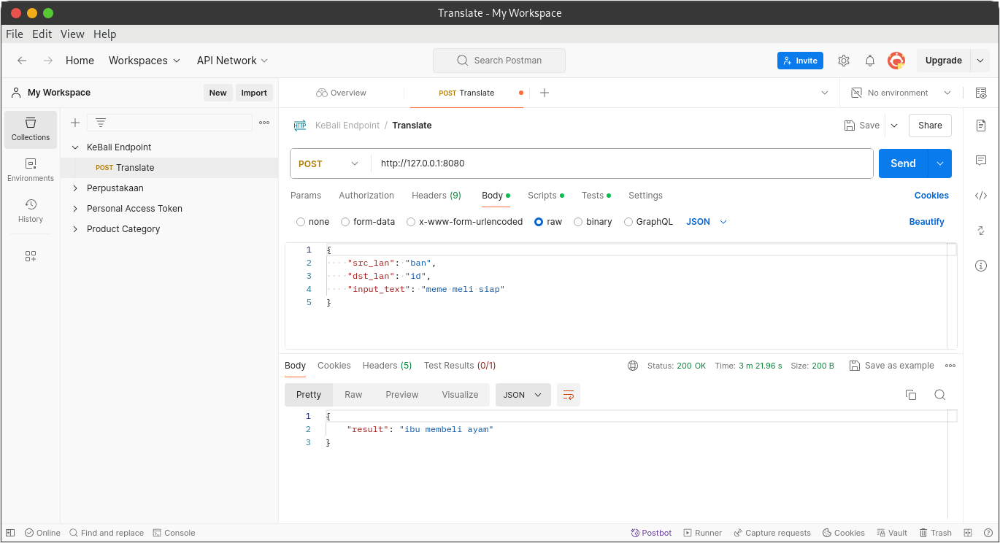

# KeBali Services

A simple code to use our endpoint for translation for KeBali app
<br>
Our current language support is:
| Languange | Languange ID |
| --- | --- |
| `balinese` | `ban` |
| `english` | `en` |
| `indonesian` | `id` |


## Installation

Clone the project
```bash
git clone https://github.com/malifnasrulloh/kebali-endpoint
```

Install the requirements
```bash
cd kebali-endpoint
python3 -m pip install -r requirements.txt
```
## Usage/Examples

Run the program
```bash
python3 main.py
```
it will open port 8080 on your local machine (you can change it in the code)

### Main points to note:
- It only recieve <b>POST</b> request
- To send POST request you will need this requirement:
    - Header: ``` Content-Type: application/json ```
    - Data :
        ``` 
        src_lan                         # source language for translating
        dst_lan                         # target language for output
        input_text                      # your text input to translate
        ```
        


#### bash
```bash
curl -H 'Content-Type: application/json' \
     -d '{ "src_lan":"ban","dst_lan":"en", "input_text": "meme meli siap"}' \
     -X POST \
     http://127.0.0.1:8080
```
#### postman

